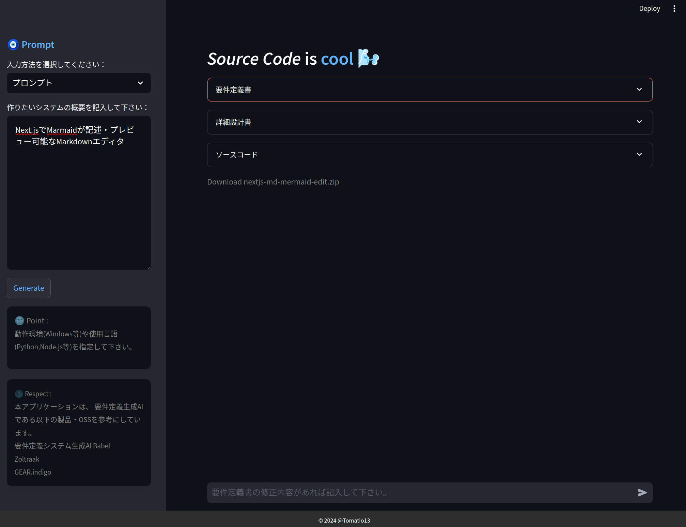
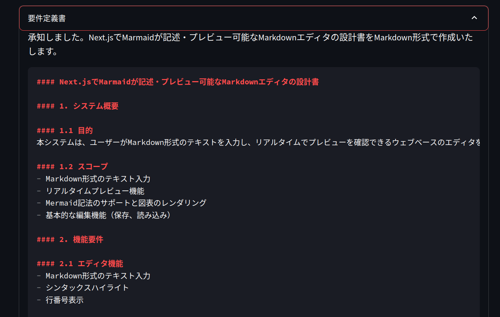
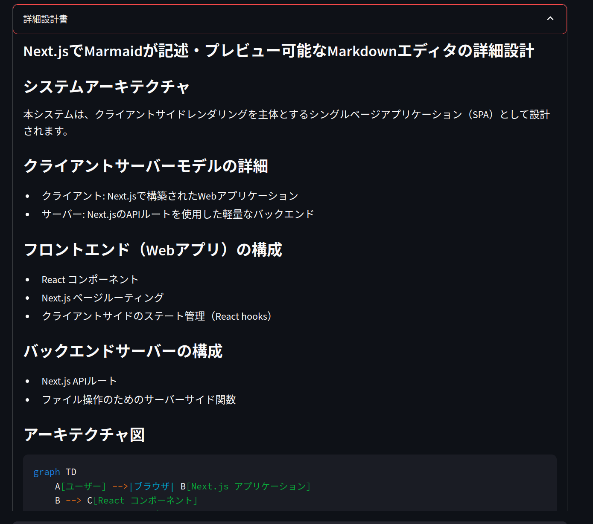
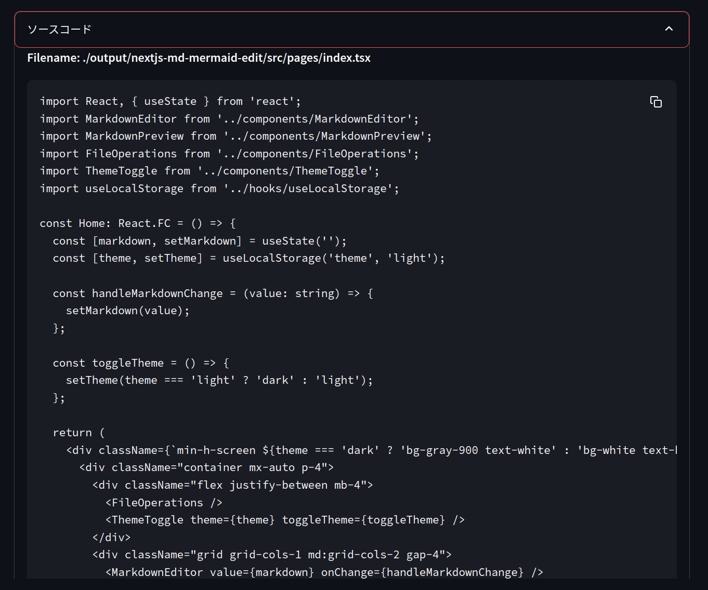

# Codexus

## 概要

`Codexus(コーデクス)`は、ソフトウェア要件定義書、詳細設計書、およびソースコードの生成を自動化するためのStreamlitアプリケーションです。OpenAIやClaudeのAPIを使用して、ユーザー入力とテンプレートに基づいて重要なソフトウェア開発文書を作成します。
`Codexus`は、「Code（コード）」と「Nexus（つながりや結びつき）」を組み合わせた造語です
この名前は、ソフトウェアがコード生成を通じて要件定義書や設計書などの重要な要素を結びつけ、自動化する機能を強調しています。

## 目次

- [Codexus](#codexus)
  - [概要](#概要)
  - [目次](#目次)
  - [用途](#用途)
  - [機能](#機能)
- [画面](#画面)
  - [必要要件](#必要要件)
  - [インストール](#インストール)
  - [使用方法](#使用方法)
  - [ファイル構成](#ファイル構成)
  - [謝意](#謝意)
  - [ライセンス](#ライセンス)

## 用途
本格的なソフトウェア生成というよりは、もう少し軽い用途でご使用下さい。

- ソフトウェアのベースの素材生成
- ソフトウェア開発やプログラミング言語の学習素材の生成
- ソフトウェア・ミドルウェアの組み合わせや実現性の可否判断
- LLM/プロンプトを変更することによるコード生成の実験

生成されたコードは動作するとは限りません、CursorやVSCodeなどのIDEで
デバックする必要があります。

本格的にシステム生成AI・ソフトウェア生成AIを活用したい場合は、
[謝意](#謝意)に記載のソフトウェアの利用を検討して下さい。

## 機能

- Markdown形式でソフトウェア要件定義書を生成。
- 要件定義書から詳細設計書を作成。
- 詳細設計書に基づいてソースコードを自動生成。
- 生成されたすべてのファイルをZIP形式でダウンロード可能。
- フィードバックを提供して生成文書とコードを反復改善。

# 画面





## 必要要件

- Python 3.8+
- OpenAI APIキー
- CLAUDE APIキー
- Streamlit
- 必要なPythonライブラリ: `openai`, `anthropic`,`pydantic`, `streamlit`

## インストール

1. リポジトリをクローンします:
   ```bash
   git clone https://github.com/Tomatio13/Codexus.git
   cd Codexus
   ```

2. 仮想環境を作成し、アクティベートします:
   ```bash
   python -m venv venv
   source venv/bin/activate  # Windowsの場合は `venv\Scripts\activate`
   ```

3. 依存関係をインストールします:
   ```bash
   pip install -r requirements.txt
   ```

4. API_KEYを.envファイルに記載してください:
   PROVIDERとMODELは必ず1つだけ指定して下さい。
   
   ```bash
   PROVIDER=ANTHROPIC
   MODEL=claude-3-5-sonnet-20240620
   ANTHROPIC_API_KEY=<your claude api key>

   # PROVIDER=OPENAI
   # MODEL=gpt-4o
   # OPENAI_API_KEY=<your openai api key>

   #PROVIDER=OLLAMA
   #MODEL=qwen2.5-coder:latest
   #OLLAMA_BASE_URL=http://localhost:11434/v1/
   #OLLAMA_MAX_TOKENS=256
   ```
   *注意事項*
   ollamaは指定可能ですが、MODELのmax_tokensやnum_ctxが小さく
   生成に失敗すること多いのでオススメしません。

## 使用方法

1. Streamlitアプリケーションを起動します:
   ```bash
   streamlit run main.py
   ```

2. Webブラウザで`http://localhost:8501`にアクセスします。

3. サイドバーにシステムの概要を入力し、「Generate」ボタンをクリックします。

4. プロンプトに従って要件定義書、詳細設計書、ソースコードを生成されます。フィードバックを提供してさらなる反復が可能です。

5. 生成された要件定義書、詳細設計書、ソースコードを固めたzipファイルをダウンロードすることが可能です。

## ファイル構成

```
Codexus/
├── src/
│   └── Codexus/
│       ├── main.py                  # メインアプリケーションスクリプト
│       ├── require_generator.py     # 文書とコードを生成するクラス
│       ├── file_manager.py          # ファイル操作のユーティリティクラス
│       ├── .env                     # PROVIDERやAPIキーを設定するファイル
│       ├── configy.yaml             # 出力先やテンプレートを指定する設定ファイル
│       ├── utils/
│           ├── header.py            # ヘッダーコンポーネント
│           ├── sidebar.py           # サイドバーコンポーネント
│           └── footer.py            # フッターコンポーネント
│       ├── templates/               # 要件定義書と設計書のテンプレート
│       └── output/                  # 生成されたファイルのディレクトリ
├── requirements.txt
└── README.md
```

フォルダtemplates配下のファイルがプロンプトのベースです。
自由に変更が可能です。

## 謝意
- 本アプリケーションは、以下のソフトウェアを参考にして開発しています。
- [要件定義システム生成AI Babel](https://www.babel-ai.com)
- [Zoltraak](https://github.com/dai-motoki/zoltraak)
- [GEAR.indigo](https://gearindigo.app/)

## ライセンス

このプロジェクトはMITライセンスの下でライセンスされています。詳細は[LICENSE](LICENSE)ファイルを参照してください。

カスタマイズが必要な部分があればお気軽にお知らせください。