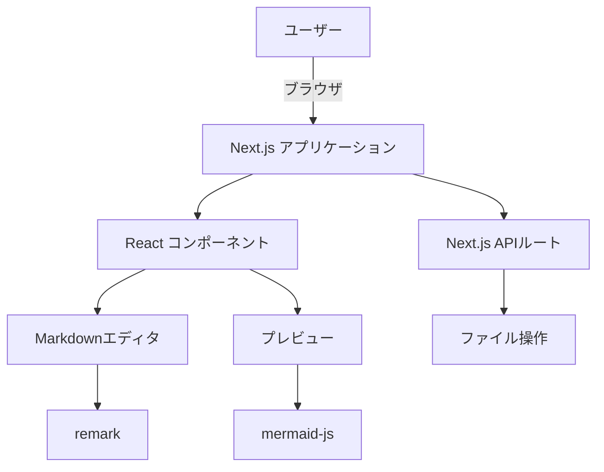
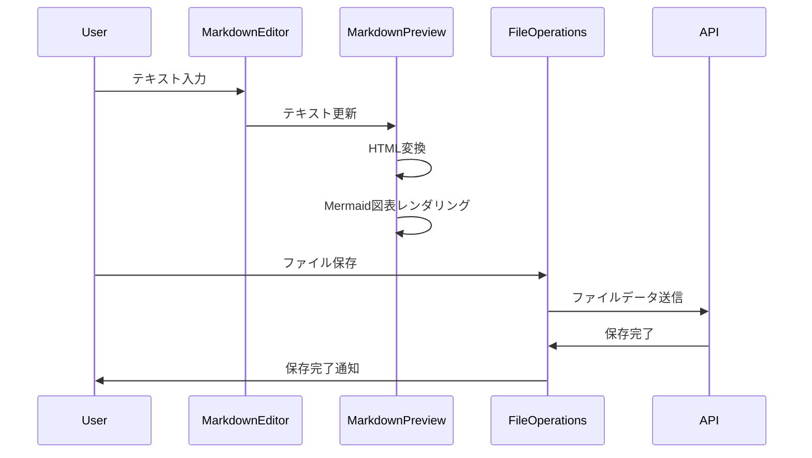
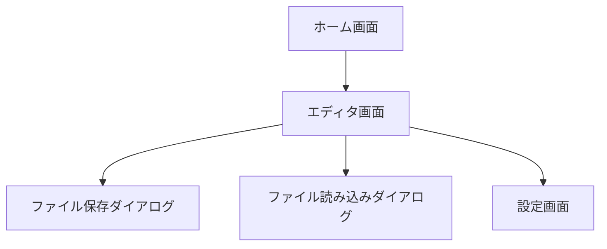

# Next.jsでMarmaidが記述・プレビュー可能なMarkdownエディタの詳細設計

## システムアーキテクチャ

本システムは、クライアントサイドレンダリングを主体とするシングルページアプリケーション（SPA）として設計されます。

### クライアントサーバーモデルの詳細

- クライアント: Next.jsで構築されたWebアプリケーション
- サーバー: Next.jsのAPIルートを使用した軽量なバックエンド

### フロントエンド（Webアプリ）の構成

- React コンポーネント
- Next.js ページルーティング
- クライアントサイドのステート管理（React hooks）

### バックエンドサーバーの構成

- Next.js APIルート
- ファイル操作のためのサーバーサイド関数

### アーキテクチャ図



## データベース設計

本システムではデータベースを使用しません。ユーザーデータはローカルストレージに保存されます。

## APIエンドポイント

本システムでは外部APIを使用しませんが、ファイル操作のための内部APIを定義します。

- GET /api/files
  - 説明: 保存されたファイルのリストを取得
- POST /api/files
  - 説明: 新しいファイルを保存
- GET /api/files/:id
  - 説明: 特定のファイルの内容を取得
- PUT /api/files/:id
  - 説明: 特定のファイルの内容を更新
- DELETE /api/files/:id
  - 説明: 特定のファイルを削除

## データモデル

ファイルデータのモデルを定義します。

```typescript
interface File {
  id: string;
  name: string;
  content: string;
  createdAt: Date;
  updatedAt: Date;
}
```

## ファイル・フォルダ構成

```markdown
markdown-editor/
├── .gitignore
├── package.json
├── package-lock.json
├── next.config.js
├── tsconfig.json
├── README.md
├── public/
│   └── favicon.ico
├── src/
│   ├── pages/
│   │   ├── index.tsx (メインページ)
│   │   ├── _app.tsx (アプリケーションのエントリーポイント)
│   │   └── api/
│   │       └── files/
│   │           ├── index.ts (ファイルリスト取得・新規作成API)
│   │           └── [id].ts (ファイル取得・更新・削除API)
│   ├── components/
│   │   ├── MarkdownEditor.tsx (Markdownエディタコンポーネント)
│   │   ├── MarkdownPreview.tsx (プレビューコンポーネント)
│   │   ├── FileOperations.tsx (ファイル操作コンポーネント)
│   │   └── ThemeToggle.tsx (テーマ切り替えコンポーネント)
│   ├── hooks/
│   │   └── useLocalStorage.ts (ローカルストレージ操作用カスタムフック)
│   ├── styles/
│   │   └── globals.css (グローバルスタイル)
│   └── utils/
│       ├── markdown.ts (Markdown変換ユーティリティ)
│       └── mermaid.ts (Mermaid図表レンダリングユーティリティ)
├── Dockerfile
└── docker-compose.yml
```

## Dockerfile

```dockerfile
# Use the official Node.js 14 image as a parent image
FROM node:14

# Set the working directory
WORKDIR /app

# Copy package.json and package-lock.json
COPY package*.json ./

# Install dependencies
RUN npm install

# Copy the rest of your app's source code
COPY . .

# Build your Next.js app
RUN npm run build

# Expose the port Next.js runs on
EXPOSE 3000

# Start the app
CMD ["npm", "start"]
```

## docker-compose.yml

```yaml
version: '3'
services:
  web:
    build: .
    ports:
      - "3000:3000"
    volumes:
      - .:/app
      - /app/node_modules
    environment:
      - NODE_ENV=production
```

## コンポーネント

1. MarkdownEditor
   - 役割: Markdownテキストの入力と編集
   - 入力: ユーザーのキーボード入力
   - 出力: 編集されたMarkdownテキスト

2. MarkdownPreview
   - 役割: Markdownテキストのプレビュー表示
   - 入力: Markdownテキスト
   - 出力: レンダリングされたHTML

3. FileOperations
   - 役割: ファイルの保存、読み込み、新規作成
   - 入力: ファイル操作コマンド、ファイル内容
   - 出力: 操作結果、ファイル内容

4. ThemeToggle
   - 役割: ダークモード/ライトモードの切り替え
   - 入力: ユーザーのトグル操作
   - 出力: 現在のテーマ状態

## データの流れ

1. ユーザーがMarkdownEditorにテキストを入力
2. 入力されたテキストがMarkdownPreviewに渡される
3. MarkdownPreviewがテキストをHTMLに変換し、表示
4. Mermaid記法が検出された場合、mermaid-jsによって図表がレンダリング
5. ユーザーがファイル操作を行うと、FileOperationsコンポーネントがAPIを通じてデータを保存/読み込み



## ユーザーインターフェース

### 画面遷移図



### ワイヤーフレーム

エディタ画面のワイヤーフレーム:

```
+----------------------------------+
|  [ファイル操作] [テーマ切替]      |
+----------------------------------+
|                  |               |
|   Markdownエディタ | プレビュー    |
|                  |               |
|                  |               |
|                  |               |
|                  |               |
|                  |               |
+----------------------------------+
```

## 開発環境

- Node.js: v14.x
- Next.js: 12.x
- React: 17.x
- TypeScript: 4.x
- Tailwind CSS: 2.x
- remark: 13.x
- mermaid-js: 8.x

## 実行方法

1. 依存関係のインストール:
   ```
   npm install
   ```

2. 開発サーバーの起動:
   ```
   npm run dev
   ```

3. プロダクションビルド:
   ```
   npm run build
   ```

4. プロダクションサーバーの起動:
   ```
   npm start
   ```

Dockerを使用する場合:

1. Dockerイメージのビルド:
   ```
   docker-compose build
   ```

2. コンテナの起動:
   ```
   docker-compose up
   ```

## テスト

1. ユニットテスト:
   - Jest と React Testing Library を使用
   - 各コンポーネントの個別機能をテスト

2. 統合テスト:
   - コンポーネント間の連携をテスト
   - ユーザーシナリオに基づいたテストケースを作成

3. E2Eテスト:
   - Cypress を使用
   - 実際のブラウザ環境でのユーザー操作をシミュレート

テストの実行:

```
npm test
```

テストデータの準備:
- サンプルのMarkdownファイルを `__tests__/fixtures` ディレクトリに配置
- モックAPIレスポンスを `__mocks__` ディレクトリに配置

この詳細設計書に基づいて、Next.jsでMarmaidが記述・プレビュー可能なMarkdownエディタの開発を進めることができます。各コンポーネントの実装、スタイリング、そしてテストを順次進めていくことで、要件を満たすアプリケーションを構築できます。