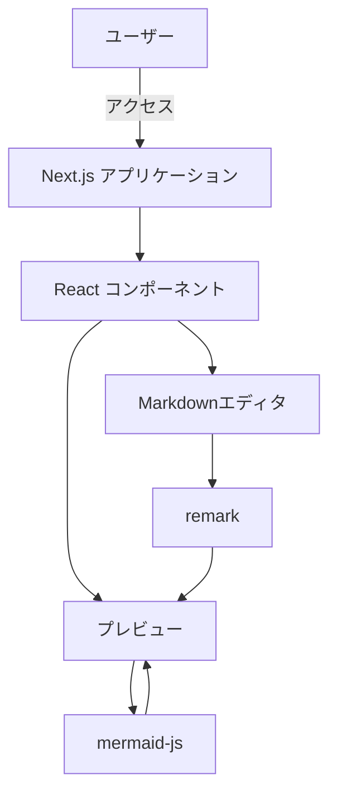
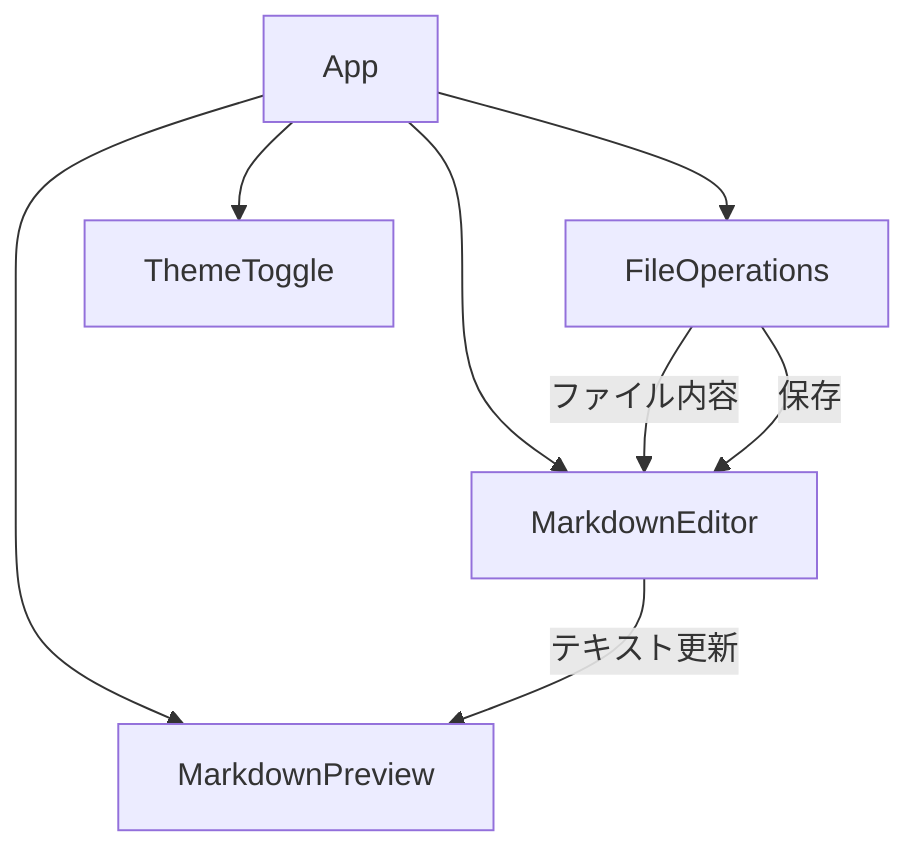
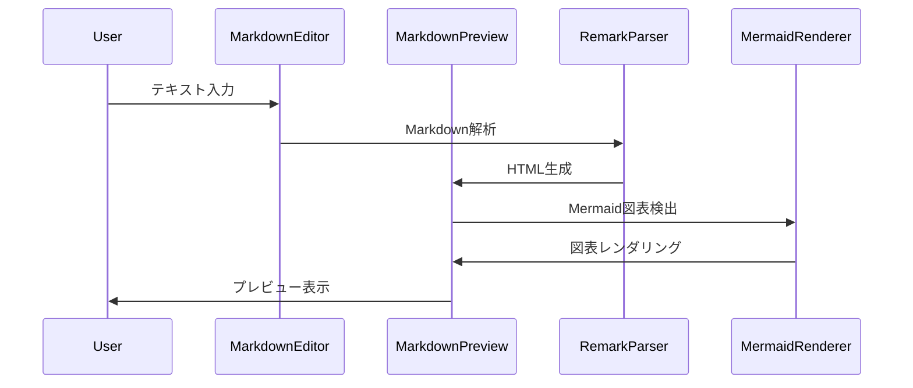

承知しました。Next.jsでMarmaidが記述・プレビュー可能なMarkdownエディタの設計書をMarkdown形式で作成いたします。

```markdown
# Next.jsでMarmaidが記述・プレビュー可能なMarkdownエディタの設計書

## 1. システム概要

### 1.1 目的
本システムは、ユーザーがMarkdown形式のテキストを入力し、リアルタイムでプレビューを確認できるウェブベースのエディタを提供することを目的としています。特に、Mermaid記法を用いた図表の記述と即時プレビューを可能にすることで、ドキュメンテーションや技術文書作成の効率を向上させます。

### 1.2 スコープ
- Markdown形式のテキスト入力
- リアルタイムプレビュー機能
- Mermaid記法のサポートと図表のレンダリング
- 基本的な編集機能（保存、読み込み）

## 2. 機能要件

### 2.1 エディタ機能
- Markdown形式のテキスト入力
- シンタックスハイライト
- 行番号表示

### 2.2 プレビュー機能
- リアルタイムでのMarkdownレンダリング
- Mermaid図表のレンダリング

### 2.3 ファイル操作
- 新規作成
- 保存（ローカルストレージ）
- 読み込み（ローカルストレージ）

### 2.4 その他
- ダークモード/ライトモード切り替え

## 3. 非機能要件

### 3.1 パフォーマンス
- エディタの入力遅延: 100ms以下
- プレビューの更新: 500ms以内

### 3.2 セキュリティ
- クロスサイトスクリプティング（XSS）対策
- 入力データのサニタイズ

### 3.3 ユーザビリティ
- 直感的なUI/UX
- レスポンシブデザイン

### 3.4 互換性
- 主要なモダンブラウザ（Chrome, Firefox, Safari, Edge）での動作保証

## 4. システム構成

### 4.1 技術スタック
- フロントエンド: Next.js, React
- Markdownパーサー: remark
- Mermaidレンダリング: mermaid-js
- スタイリング: Tailwind CSS

### 4.2 システム構成図



## 5. コンポーネント設計

### 5.1 主要コンポーネント
1. MarkdownEditor: テキスト入力用エディタ
2. MarkdownPreview: プレビュー表示用コンポーネント
3. FileOperations: ファイル操作用コンポーネント
4. ThemeToggle: テーマ切り替え用コンポーネント

### 5.2 コンポーネント関係図



## 6. データフロー

### 6.1 エディタ入力からプレビューまでのフロー



## 7. API設計

本システムは主にクライアントサイドで動作するため、外部APIは使用しません。ただし、将来的な拡張性を考慮して、以下のような内部APIを定義します。

### 7.1 ファイル操作API

```typescript
interface FileOperationsAPI {
  saveFile(content: string): Promise<void>;
  loadFile(): Promise<string>;
  createNewFile(): void;
}
```

### 7.2 テーマ切り替えAPI

```typescript
interface ThemeAPI {
  toggleTheme(): void;
  getCurrentTheme(): 'light' | 'dark';
}
```

## 8. セキュリティ考慮事項

1. ユーザー入力のサニタイズ
   - マークダウンのレンダリング時に、潜在的な悪意のあるスクリプトを無効化
2. コンテンツセキュリティポリシー（CSP）の実装
   - インラインスクリプトの実行を制限
3. HTTPS通信の強制
   - セキュアな通信を確保

## 9. テスト計画

1. ユニットテスト
   - 各コンポーネントの個別機能テスト
2. 統合テスト
   - コンポーネント間の連携テスト
3. E2Eテスト
   - ユーザーシナリオに基づいた全体テスト
4. パフォーマンステスト
   - 大量のテキスト入力時の応答性テスト
5. クロスブラウザテスト
   - 主要ブラウザでの動作確認

## 10. 展開計画

1. 開発環境: ローカル開発環境
2. テスト環境: Vercel Preview Deployments
3. 本番環境: Vercel Production Deployment

CI/CDパイプラインを構築し、GitHub ActionsとVercelを連携させて自動デプロイを実現します。

## 11. 保守計画

1. 定期的なライブラリアップデート
2. ユーザーフィードバックに基づく機能改善
3. パフォーマンスモニタリングと最適化
4. セキュリティパッチの適用

## 12. 今後の拡張性

1. 複数ユーザーでの同時編集機能
2. クラウドストレージとの連携
3. カスタムテーマ機能
4. プラグインシステムの導入

以上が、Next.jsでMarmaidが記述・プレビュー可能なMarkdownエディタの設計書となります。この設計書に基づいて開発を進めることで、効率的かつ拡張性の高いシステムを構築することができます。
```

この設計書は、要件定義から具体的な実装計画まで網羅しています。Markdown形式で記述し、図表にはmermaidを使用しています。この設計書を基に、実際の開発を進めることができます。